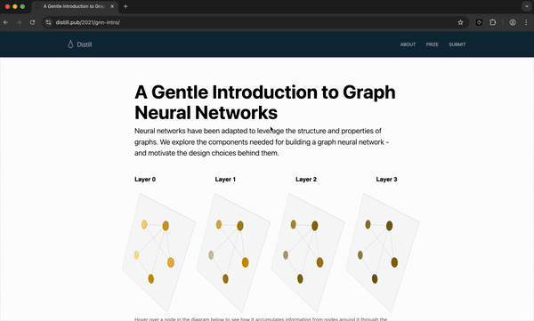

# Aha: ELI5 Chrome Extension 



## Overview

**Aha** is a Chrome extension that simplifies complex terms into easy-to-understand "Explain Like I'm 5" (ELI5) explanations. Highlight any phrase and get a quick breakdown using the **Cerebras Llama 3.1 80b** language model, with extra resources provided by **Exa.ai**.

## Features

- **easy access**: Highlight text and hit Command/Ctrl + Shift + X
- **lightning fast**: Uses **Cerebras Llama 3.1 80b** for lighting-fast responses.
- **context-aware**: Uses the page title as context to explain the highlighted term
- **useful resources**: Fetch additional learning materials via **Exa.ai**.
- **markdown support**: easily copy explanations in markdown format
- **one-click learning**: open all links in new tabs with one click.
- **search history**: previous search terms stored in local storage

## Installation

1. Clone the repository:
   ```
   git clone https://github.com/benthecoder/aha.git
   ```
2. Replace API keys
   - Open `src/cerebras.js` and replace `CEREBRAS_API_KEY` with your [Cerebras](https://www.cerebras.ai/) API key.
   - Open `src/exa.js` and replace `EXA_API_KEY` with your [Exa.ai](https://exa.ai/) API key.
3. Load the extension in Chrome:
   - Open `chrome://extensions/` in Chrome.
   - Enable "Developer mode" in the top right.
   - Click "Load unpacked" and select the project

## TODO

- create a server to host API calls
